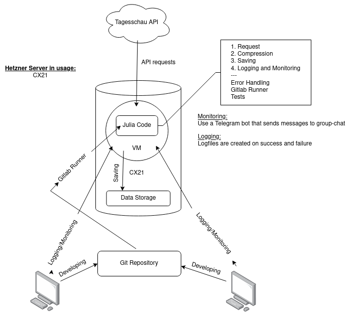

# Tagesschau Acquisition

In this project "Tagesschau Acquisition", our team of four students did some data acquisition on the German news website "tagesschau.de". Their website offers an API for their news, and we downloaded this data in 5 min. intervals for a duration of 1 week.

## System architecture



## Prerequisites
You need to have julia installed. For our development and production environment we used version 1.8.5.
You can check your julia version with `julia --version`.

We used `crontab` for executing the julia script in a scheduled way. Make sure you have `crontab` installed, or use something similar.


## How to use this project

1. `git clone` the repository
2. Change into the new folder `tagesschau-acquisition`
3. You can also add your telegram bot data to the `src/telegram_api.jl`. Here you can specify the bot token and the chat_id the bot will send its data to. This bot will inform you about the state of 
gathering data.
4. Execute the the main script using `julia src/main.jl`
This will create a new file in ```folder_to_ignore/data/<current_date> <current_time>.json```.
You can check the logfiles in `folder_to_ignore/logs/`to see if everything was going right. Currently there will be `info.log` and `error.log` created for the process.
5. The files `src/decompress_file.jl` and `src/decompress_files.jl` are there to decompress a specific file, or even decompress a complete folder.
You can use those files by specifying the source and target as follows `julia --project=. src/decompress_file.jl source-file target-file` or even `julia --project=. src/decompress_file.jl source-folder target-folder`.
The files that are decompressed are named with `\_decompressed` at the end.

### Scheduled Execution
For this step you can use the `crontab` program. `crontab` can execute commands from a given shell usually bash in a scheduled way.
For this project we have added ```*/5 * * * *     root    cd /root/test5/ && /root/julia-1.8.5/bin/julia src/main.jl > /root/test5/folder_to_ignore/logs/cron.log 2>&1``` to the `/etc/crontab` file.
You could also edit this table by using `crontab -e` on the cli.


